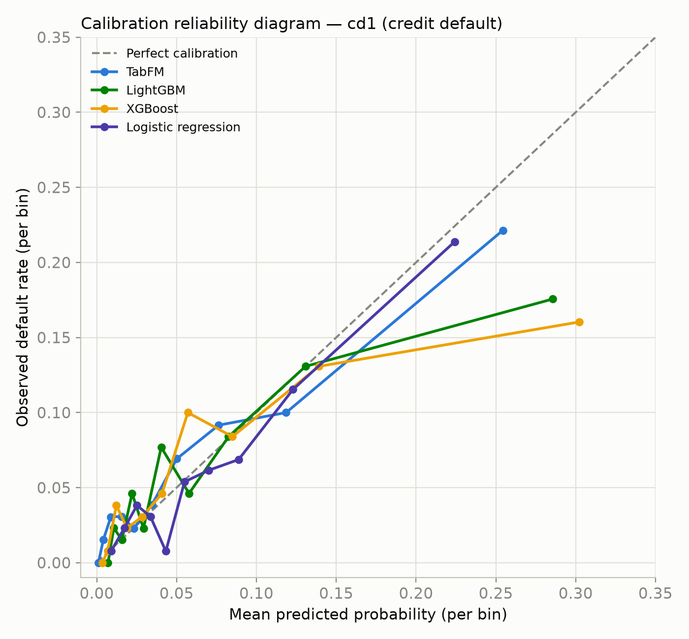
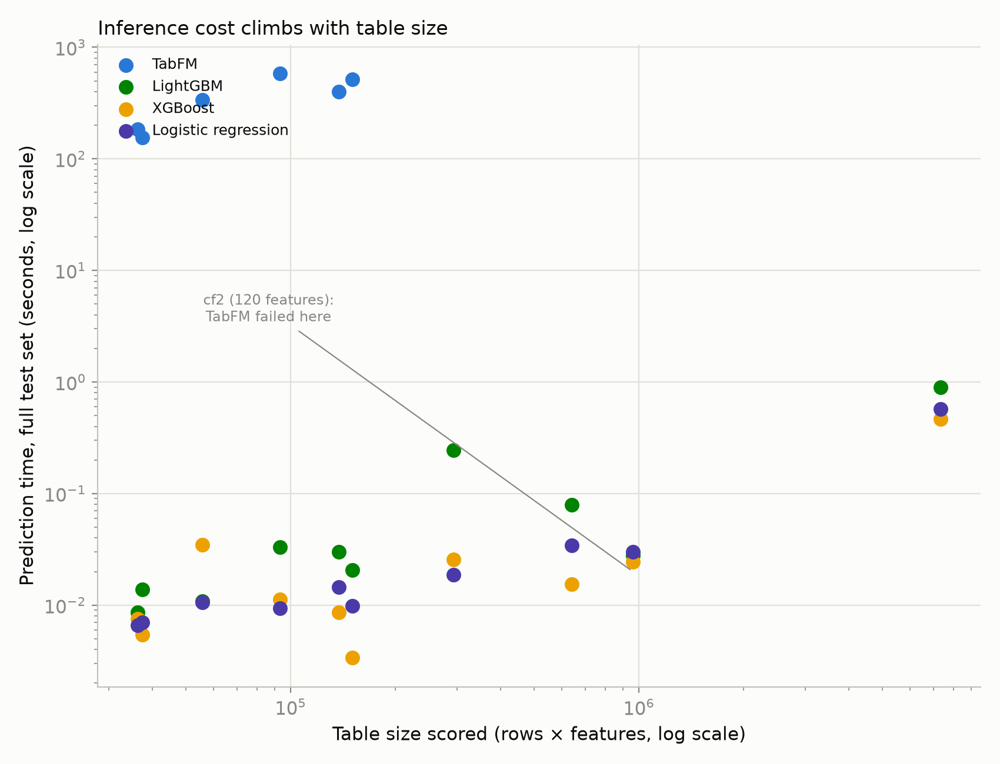
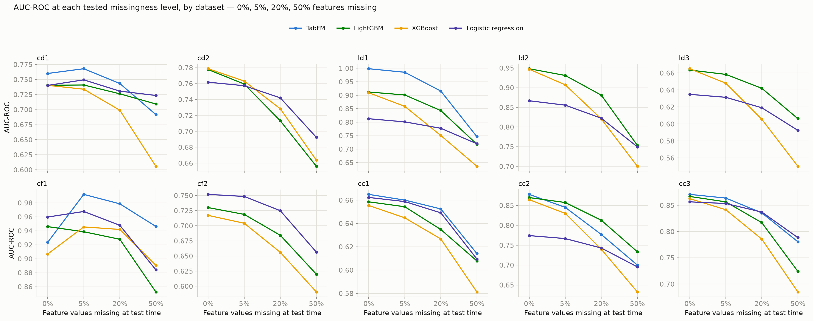
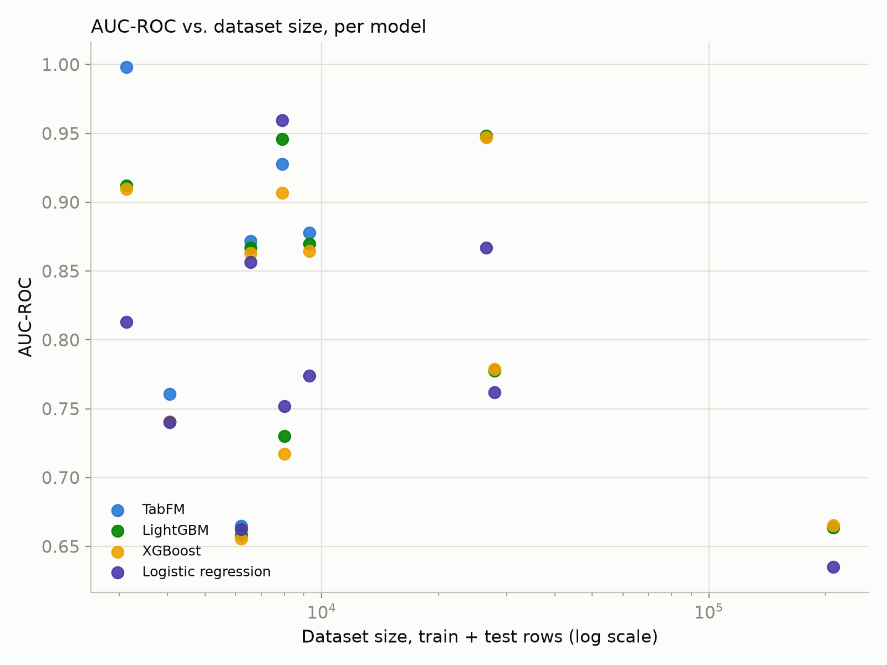

# Google's TabFM vs. Tuned Classical Machine Learning: A Production Evaluation on Financial Risk Data

A zero-shot tabular foundation model — Google's TabFM — currently claims to match or exceed tuned gradient-boosted trees without dataset-specific training. This is a production-relevant claim: financial risk teams spend real engineering time on feature pipelines, hyperparameter search, and retraining schedules for XGBoost and LightGBM models. If a foundation model can replace that work and still hold accuracy, the cost savings are substantial.

This evaluation tests that claim directly, on ten real financial-risk datasets, against tuned XGBoost, LightGBM, and logistic regression. It is not a leaderboard comparison. Seven criteria were used, chosen because each one, independently, can disqualify a model regardless of its ranking accuracy: predictive performance, calibration, inference cost, explainability, fairness, robustness (to missing data and dataset scale), and licensing.

The result is not "the foundation model wins" or "classical machine learning still wins." It is a set of specific, quantified trade-offs, some of which point toward the foundation model and most of which point away from deploying it today.

## Quick definitions

- **AUC-ROC** — how well a model ranks risky cases above safe ones. 0.5 = random guessing, 1.0 = perfect ranking.
- **Calibration error (ECE)** — how far a model's predicted probability is from the real observed rate at that probability. A model that says "20% risk" 100 times should be right about 20 times. Lower is better.
- **SHAP** — the standard method for explaining one prediction: which features pushed it up or down, and by how much. US lending law generally requires this kind of explanation for a credit denial.
- **Disparate-impact ratio / equalized-odds gap** — standard fair-lending checks comparing outcomes across a protected group (e.g. gender). A disparate-impact ratio under 0.8 is a regulatory red flag; a larger equalized-odds gap means the model treats the two groups less equally.
- **Zero-shot** — no training on this specific dataset. The model reads the training data as context at prediction time instead of learning from it through gradient updates.

## The production question

The claim under test, stated precisely, is this: given a real, moderately-sized financial-risk dataset, can a zero-shot foundation model produce a production-grade risk score without the feature engineering, hyperparameter tuning, and retraining infrastructure a classical pipeline requires?

"Production-grade" is doing the work in that sentence. A risk score can rank well and still fail for reasons that have nothing to do with ranking accuracy:

- If it's miscalibrated, it misprices reserves.
- If it can't produce a SHAP explanation within operational time and memory limits, it can't support an adverse-action notice — several jurisdictions require one by regulation for credit decisions.
- If its fairness profile differs materially from the incumbent model's, it changes the compliance posture of the system, independent of accuracy.
- If it can't be licensed for commercial use, it can't ship at all, regardless of everything above.

None of these are hypothetical concerns specific to this evaluation. They are the standard set of checks a risk model goes through before a production release in a regulated environment. The question this evaluation asks is whether this tabular foundation model, as currently released, passes those checks — not whether it can produce a competitive AUC-ROC number, which is a necessary but far from sufficient condition.

## Why accuracy-only benchmarks don't settle this

Most public evaluations of tabular foundation models report a single number: aggregate AUC-ROC or accuracy across a benchmark suite, compared to a tuned GBDT baseline. That number is useful as a first filter, but it is not sufficient to make a deployment decision, for two reasons.

First, a single aggregate number can't distinguish real accuracy gains from unreliable confidence. A separate study, testing tabular foundation models across 112 datasets (the TALENT benchmark), found that these models get the highest average accuracy, but their confidence estimates are less trustworthy exactly where accuracy is highest. High accuracy and reliable uncertainty are two different things, and one doesn't guarantee the other.

Second, an aggregate number hides exactly the information a deployment decision needs: which datasets a model could run on, which it couldn't, and what that gap costs to work around. A model that clears 0.85 AUC-ROC on 6 of 10 datasets and produced no result on the other 4 is not accurately summarized by its score on the 6 it completed. Which datasets it could and couldn't run on — and why — is the more decision-relevant fact, and it disappears entirely inside a single aggregate metric.

This evaluation was designed to preserve that information rather than average it away.

## Evaluation design

**Data.** FinBench: 10 financial-risk datasets — credit-card default (2), loan default (3), credit-card fraud (2), customer churn (3). All binary classification, all real mixed-type tables (not synthetic), with the missing-value patterns and feature scales that come from actual financial records. Classical models get standard pre-encoded numeric arrays; TabFM gets raw, human-readable tables with real column names and category strings, matching how its own documentation says to use it.

**Models.** TabFM (Google, ~6.5GB), used zero-shot with no dataset-specific training, evaluated against XGBoost, LightGBM, and logistic regression — each genuinely tuned via a per-dataset random hyperparameter search (50 trials for the two GBMs, 20 for logistic regression), selected by validation AUC-ROC and scored on the held-out test set, not a single fixed config applied everywhere. CatBoost was left out on purpose: XGBoost and LightGBM already give two independently-implemented GBM approaches, and they track each other closely enough in this data that a third GBM library was unlikely to change the comparison.

**Metrics.** The tables below report AUC-ROC (ranking), calibration error (probability quality), predict time (cost), SHAP feasibility and latency (explainability), and equalized-odds gap (fairness) — the metrics shown were picked because each one can independently block a real deployment, not because they're standard in ML benchmarking papers. The full result set, including PR-AUC, F1, Brier score, and peak GPU memory per dataset, is in the linked repository below.

## Findings

### Predictive performance

On the 6 of 10 datasets TabFM was able to complete, it scored highest of all four models on 5 of them:

| Dataset | Features | XGBoost | LightGBM | Logistic Regression | TabFM |
|---|---:|---:|---:|---:|---:|
| Credit Default 1 (cd1) | 9 | 0.740 | 0.741 | 0.740 | 0.761 |
| Credit Default 2 (cd2) | 23 | 0.779 | 0.778 | 0.762 | — |
| Loan Default 1 (ld1) | 12 | 0.909 | 0.912 | 0.813 | 0.998 |
| Loan Default 2 (ld2) | 11 | 0.947 | 0.948 | 0.867 | — |
| Loan Default 3 (ld3) | 35 | 0.665 | 0.664 | 0.635 | — |
| Credit Fraud 1 (cf1) | 19 | 0.907 | 0.946 | 0.960 | 0.928 |
| Credit Fraud 2 (cf2) | 120 | 0.717 | 0.730 | 0.752 | — |
| Customer Churn 1 (cc1) | 9 | 0.655 | 0.659 | 0.662 | 0.665 |
| Customer Churn 2 (cc2) | 10 | 0.864 | 0.870 | 0.774 | 0.878 |
| Customer Churn 3 (cc3) | 21 | 0.863 | 0.867 | 0.857 | 0.872 |

*AUC-ROC, higher is better, XGBoost/LightGBM/logistic regression genuinely tuned per dataset (see Evaluation design). A dash means TabFM did not produce a result on that dataset within this evaluation's GPU budget — see Inference cost below for why.*

This isn't a comparison quietly stacked in the foundation model's favor: the classical models actually score higher on this 6-dataset subset than they do on the full 10, even after tuning. It's also not a clean sweep — on `cf1`, both logistic regression (0.960) and tuned LightGBM (0.946) now beat TabFM (0.928) outright; TabFM only stays ahead of XGBoost there. Everywhere else TabFM completed, it still ranks first of the four. Why TabFM didn't produce a result on the other 4 datasets is covered in Inference cost, below.

### Calibration

Ranking accuracy says nothing about whether a model's probability itself is trustworthy — whether a score of 0.73 actually corresponds to a 73% observed event rate. In financial risk, that probability feeds pricing and capital-reserve calculations directly, not just the ranking.

| Dataset | XGBoost | LightGBM | Logistic Regression | TabFM |
|---|---:|---:|---:|---:|
| cd1 | 0.024 | 0.021 | 0.011 | 0.014 |
| cd2 | 0.010 | 0.012 | 0.019 | — |
| ld1 | 0.028 | 0.041 | 0.020 | 0.015 |
| ld2 | 0.009 | 0.016 | 0.021 | — |
| ld3 | 0.006 | 0.007 | 0.009 | — |
| cf1 | 0.004 | 0.005 | 0.003 | 0.002 |
| cf2 | 0.037 | 0.016 | 0.012 | — |
| cc1 | 0.036 | 0.023 | 0.025 | 0.021 |
| cc2 | 0.019 | 0.017 | 0.025 | 0.011 |
| cc3 | 0.021 | 0.017 | 0.027 | 0.020 |

*Mean calibration error, lower is better, XGBoost/LightGBM/logistic regression genuinely tuned per dataset. Dash = not evaluated within this evaluation's GPU budget.*

*Reliability diagram for `cd1` specifically, not an average across all 10 datasets — each point is one bin of predictions, plotting what the model predicted against what actually happened. A model sitting on the dashed diagonal is perfectly calibrated.*

This ordering doesn't track ranking accuracy — and tuning changed the calibration story more than it changed the ranking one. Before tuning, LightGBM was clearly the worst-calibrated model in this comparison. After a real hyperparameter search, that inverts: LightGBM is now the *best*-calibrated of the three classical models, worst on only 2 of 10 datasets (`ld1`, `cf1`). Logistic regression — previously the safest-calibrated model almost everywhere — now has the worst calibration error on 5 of 10 (`cd2`, `ld2`, `ld3`, `cc2`, `cc3`), running 1.3x–1.6x higher than LightGBM's on those same five. XGBoost sits in between, worst on 3 of 10 (`cd1`, `cf2`, `cc1`). None of this was the tuning objective — the search only optimized for validation AUC-ROC — but regularization search appears to reliably pull an unregularized GBM's probabilities back from overconfidence, while logistic regression's winning configs (lower `C`, sometimes `elasticnet`) trade a little calibration for a small ranking gain. The practical lesson holds regardless of which specific model comes out worst on a given dataset: "tuned for accuracy" and "well-calibrated" are not the same property, and checking one doesn't tell you about the other.

### Inference cost

Zero-shot eliminates gradient-based training. It does not eliminate compute cost — it relocates it. Instead of compressing the training set into learned weights once, a zero-shot model passes the entire training set through the network as in-context examples on every single prediction call. The cost that a classical pipeline pays once, at training time, a zero-shot model pays on every inference.

| Dataset | Rows | Features | XGBoost | LightGBM | Logistic Regression | TabFM |
|---|---:|---:|---:|---:|---:|---:|
| cd1 | 4,043 | 9 | 0.008s | 0.009s | 0.007s | 183s |
| cd2 | 27,900 | 23 | 0.015s | 0.079s | 0.034s | — |
| ld1 | 3,128 | 12 | 0.005s | 0.014s | 0.007s | 156s |
| ld2 | 26,633 | 11 | 0.026s | 0.244s | 0.019s | — |
| ld3 | 209,708 | 35 | 0.464s | 0.899s | 0.574s | — |
| cf1 | 7,902 | 19 | 0.003s | 0.021s | 0.010s | 515s |
| cf2 | 7,999 | 120 | 0.024s | 0.028s | 0.030s | — |
| cc1 | 6,184 | 9 | 0.035s | 0.011s | 0.011s | 339s |
| cc2 | 9,300 | 10 | 0.011s | 0.033s | 0.009s | 580s |
| cc3 | 6,550 | 21 | 0.009s | 0.030s | 0.015s | 400s |

*Predict time on the full test set, XGBoost/LightGBM/logistic regression genuinely tuned per dataset. Dash = not evaluated within this evaluation's GPU budget (the model exhausted available GPU memory on that dataset).*

Per dataset, TabFM's inference cost ran roughly 9,700x to 172,000x XGBoost's — a much wider range than a fixed-config comparison would show, because a tuned XGBoost's own tree count varies per dataset (the winning configs range from roughly 100 to 800 estimators), which directly changes how fast it predicts. That ratio still climbs with the size of the table being scored — rows and columns together. That's why TabFM didn't produce a result on 4 of the 10 datasets: this evaluation ran on a single 16GB GPU, and the widest and largest tables in the suite exceeded that budget. A larger GPU would very likely change this.

*Every dataset-model pair, log-log scale. Cost climbs with total table size — rows and columns together — not column count alone.*

### Explainability

Financial institutions operating under fair-lending regulation are generally required to provide a specific, per-applicant reason for an adverse credit decision. SHAP is the standard method for generating that reason from a model whose internal logic isn't directly interpretable, and it is a standard component of a production risk-scoring pipeline, not an optional add-on.

This follows directly from the inference-cost numbers above. SHAP requires hundreds of prediction calls per explained instance. At TabFM's per-call cost, that's not "slower" — it wasn't achievable within this evaluation's hardware budget. TabFM's SHAP step ran out of memory on every dataset attempted: first with its ensemble size cut eightfold (from 32 down to 4) on the main 16GB GPU, then even at the smallest possible ensemble size (1) on a separate, smaller 8GB GPU tested specifically for this case.

This is a statement about what this evaluation's hardware could support, not a claim that TabFM is inherently unexplainable — a larger GPU budget may change this materially. What it does establish: on the hardware most teams evaluating this today are likely to have, generating adverse-action explanations at any real volume isn't currently practical with TabFM. A team that needs them can't get them from this model within a realistic budget.

### Fairness

TabFM is trained on synthetic data generated from structural causal models. The classical baselines in this evaluation are trained exclusively on the population each one scores. This evaluation checked whether that difference in training-data origin produces a measurable difference in fair-lending risk, using equalized-odds gap and disparate-impact ratio computed on the datasets that carry a clean, binary protected attribute.

| Dataset | XGBoost | LightGBM | Logistic Regression | TabFM |
|---|---:|---:|---:|---:|
| cd1 | 0.075 | 0.169 | 0.237 | 0.296 |
| cd2 | 0.063 | 0.072 | 0.167 | — |
| cf2 | 0.116 | 0.081 | 0.008 | — |
| cc1 | 0.085 | 0.084 | 0.202 | 0.193 |
| cc2 | 0.078 | 0.066 | 0.218 | 0.085 |
| cc3 | 0.059 | 0.036 | 0.034 | 0.058 |

*Equalized-odds gap, lower is better, computed on the 6 datasets with a clean binary protected attribute (gender), XGBoost/LightGBM/logistic regression genuinely tuned per dataset. Dash = not evaluated within this evaluation's GPU budget.*

This is the least intuitive result in the evaluation, and tuning made it less intuitive still. Before tuning, logistic regression had the worst equalized-odds gap on 5 of the 6 datasets checked — a clean, easy-to-report pattern. After a real hyperparameter search, that pattern breaks apart: logistic regression is worst on 3 of 6 (`cc1`, `cc2`, `cd2`), XGBoost is worst on 2 (`cc3`, `cf2`), and TabFM — untouched by any of this tuning — is worst on the remaining one (`cd1`). There is no longer a single "riskiest" model type by this measure; which model has the worst fair-lending profile depends on the specific dataset, not on whether the model is linear, tree-based, tuned, or zero-shot. On `cc1`, logistic regression's disparate-impact ratio still falls to roughly half the commonly used regulatory threshold (0.429 against a 0.8 floor) even after tuning. That's easy to overlook, but a linear model encodes the same population-level disparity present in its training data as a more flexible model would — it just expresses that disparity through a fixed coefficient instead of a conditional split. Interpretability and fairness are separate properties, and neither a model's simplicity nor its tuning status guarantees the second one.

### Robustness

Two conditions were tested. First, degradation under increasing missingness, simulating incomplete applicant data — a routine condition in production, not an edge case.

| Dataset | XGBoost | LightGBM | Logistic Regression | TabFM |
|---|---:|---:|---:|---:|
| cd1 | -18% | -4% | -2% | -9% |
| cd2 | -15% | -16% | -9% | — |
| ld1 | -30% | -21% | -11% | -25% |
| ld2 | -26% | -21% | -14% | — |
| ld3 | -17% | -9% | -7% | — |
| cf1 | -2% | -10% | -8% | +2% |
| cf2 | -18% | -15% | -13% | — |
| cc1 | -11% | -8% | -8% | -8% |
| cc2 | -27% | -16% | -10% | -20% |
| cc3 | -21% | -16% | -8% | -10% |

*Change in AUC-ROC from 0% to 50% missing feature values, XGBoost/LightGBM/logistic regression genuinely tuned per dataset. Dash = not evaluated within this evaluation's GPU budget.*

*All 4 tested missingness levels (0%, 5%, 20%, 50%), not just the net change in the table above — one panel per dataset. The shape of each line matters as much as where it ends up: `cf1`'s TabFM line rises before it falls, a pattern the table's single before/after number can't show.*

XGBoost's accuracy degrades faster than LightGBM's on 8 of the 10 datasets — over 4x LightGBM's degradation rate on `cd1` at the extreme — with two exceptions (`cd2`, `cf1`) where a tuned XGBoost actually held up better. Both models advertise native missing-value handling; the two libraries' internal default-direction strategies for missing splits are not equivalent in practice, and tuning shifts where the gap shows up rather than closing it.

Ranking accuracy and calibration degrade under missingness in different patterns. Logistic regression is the most robust of the four models on ranking accuracy on 4 of the 6 datasets TabFM is evaluated on; TabFM is clearly most robust on `cf1`, where its ranking accuracy actually improves under missingness instead of degrading, and edges out a near three-way tie with LightGBM and logistic regression on `cc1` (all three round to -8% in the table above). On calibration, the pattern flips: XGBoost's Brier score is the most damaged of the four models on 5 of those same 6 datasets — including a roughly 2.3x increase on `cf1`, the same dataset where its ranking barely moved. TabFM's calibration is the outlier on a single dataset, `ld1`, where its Brier score increases roughly 48x, more than any other model on any other dataset in this table. The general pattern holds regardless of which specific model: a model can keep ranking risky applicants above safe ones correctly while its output probability, the number that actually feeds a pricing or reserve calculation, becomes progressively less meaningful. A monitoring setup that tracks only ranking metrics would not catch this until it had already affected downstream decisions built on the probability itself.

Second: does the foundation-model advantage hold as datasets get bigger? The answer is a hard cutoff, not a gradual decline: the three largest datasets in the suite (`cd2`, `ld2`, `ld3`, all over 25,000 rows) are exactly the three TabFM did not produce a result on within this evaluation's GPU budget — the same limit covered under Inference cost. Any team planning to run TabFM on a bigger dataset than tested here should treat this as a hardware-planning input: what a 16GB budget supports today, not a verdict on the model's ceiling.

*Every dataset-model pair, log-scale x-axis. TabFM has no point past roughly 10,000 rows — the three largest datasets in the suite are exactly the three it couldn't run on within this evaluation's GPU budget.*

### Licensing

Every finding above assumes a model that can, in principle, be deployed. That assumption does not currently hold for TabFM. Its pretrained weights are released under a non-commercial license. Its code repository is released under Apache 2.0, which does not change this conclusion: the code has no value without the weights, and retraining an equivalent model from scratch would require reproducing both the training data pipeline and the compute budget behind it, which eliminates the entire zero-shot cost proposition the model is built around.

For the checkpoint evaluated here, licensing restrictions prevent commercial deployment. This is independent of the model's technical performance and may change as licensing terms evolve.

## What this means for a production decision

TabFM beat both tuned GBMs on ranking on 5 of the 6 datasets it completed — the exception is `cf1`, where tuned LightGBM also passes it — and on calibration on 5 of 6 as well, with a different single exception (`cc3`, where tuned LightGBM edges it out). That's a real advantage, but no longer a completely clean sweep now that the classical baselines are genuinely tuned rather than left at fixed defaults, and it's not the only thing that determines whether a model belongs in production.

Inference cost, GPU memory, and explainability cost are the three properties that most directly determine whether TabFM is usable at all, independent of accuracy: it couldn't run on 4 of the 10 datasets tested within the 16GB GPU budget available for this evaluation, and it doesn't support SHAP-based explanation at a cost compatible with routine regulatory use. Fairness doesn't track model family in a way that lets a team assume a foundation model is safer by default — it has to be measured per model, per dataset, whether that model is a foundation model or a linear regression. And licensing, independent of every technical result, currently rules out commercial deployment of this checkpoint entirely.

The correct framing for a team evaluating this category today is not "is the foundation model better than classical machine learning" — a question this evaluation's own results resist answering cleanly, since both logistic regression and tuned LightGBM beat TabFM on `cf1`, and no single classical model has a consistently worse fairness profile than the others once the baselines are actually tuned. It is: the accuracy case for zero-shot tabular foundation models is real and worth tracking closely, the operational cost of realizing that accuracy is currently an order of magnitude or more higher than the incumbent classical pipeline, and the licensing terms attached to this checkpoint make the question moot for any team building a commercial product today, independent of how the cost and accuracy trade-offs eventually resolve.

## Limitations

This evaluation covers a single zero-shot tabular foundation model (TabFM), not an exhaustive survey of the category — other tabular foundation models may behave differently on these same dimensions. The intent was to determine whether this specific, widely-discussed checkpoint is currently competitive on the dimensions that matter for production deployment.

This evaluation covers ten financial-risk datasets. The results should not be assumed to generalize to other domains — healthcare, retail, and manufacturing data carry different missingness patterns, feature-count distributions, and regulatory constraints than financial risk data, and none of that was tested here.

Each dataset used a single train/test split. That is sufficient to compare the four models against each other consistently within this evaluation, but it does not produce a confidence interval on any individual metric reported above. Repeated resampling or bootstrap estimation would be required to state how much any single number here would vary on a re-run, and that was not performed.

Model checkpoints and vendor documentation change over time. The findings above reflect what was published and available at the time this evaluation was run, not a permanent property of the vendor's offering.

The classical baselines were tuned by selecting purely on validation AUC-ROC, which has a real, demonstrated blind spot: `class_weight="balanced"` is excluded from logistic regression's search space because, when included, it improved ranking slightly while making calibration far worse on several datasets — a trade-off AUC-ROC-only selection cannot see. The same blind spot could still be present in the surviving hyperparameter ranges in a subtler form. A search that also weighted calibration or fairness might land on different winning configurations than the ones reported here.

## Recommendation

For a team building a production financial-risk system today: deploy tuned XGBoost or LightGBM. There is no licensing exposure, per-prediction cost is three to four orders of magnitude lower, and the accuracy gap measured here, while real, is not large enough to be disqualifying on its own — particularly once calibration is checked regardless of which GBM is chosen: post-tuning, XGBoost is worst-calibrated on 3 of the 10 datasets tested here and LightGBM on 2, with no consistent winner, and standard post-hoc recalibration (e.g. Platt scaling) closes most of that gap either way.

For a team tracking this category as a longer-term technical bet: the accuracy case is genuine and worth continued evaluation as new checkpoints and licensing terms are released. The cost, memory, and explainability findings in this evaluation should be treated as inputs to that planning now, not discovered mid-pilot once a commercial license becomes available.

For a team already operating under TabFM's non-commercial license: treat inference cost as a recurring operational expense rather than a one-time integration cost, and do not assume SHAP-based explanation is available within a realistic hardware budget — at TabFM's measured cost profile, it may not be, at any volume relevant to production compliance requirements.

Full methodology, all 36 dataset-model result combinations, the evaluation code, and the raw data behind every number in this article are available at [github.com/ConceptualCode/tabfm-financial-risk-benchmark](https://github.com/ConceptualCode/tabfm-financial-risk-benchmark).
