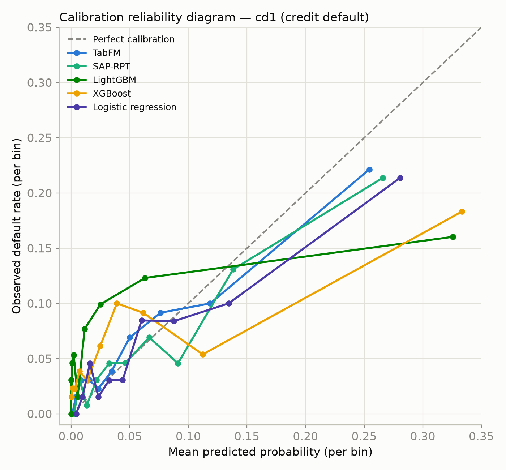
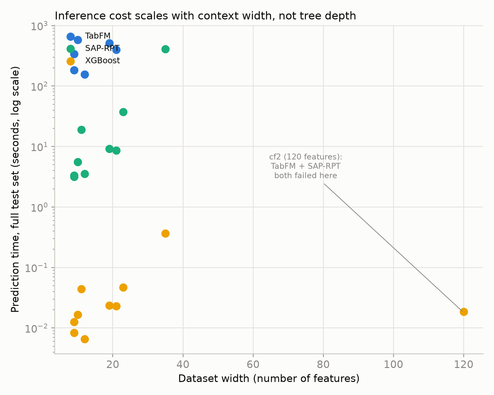
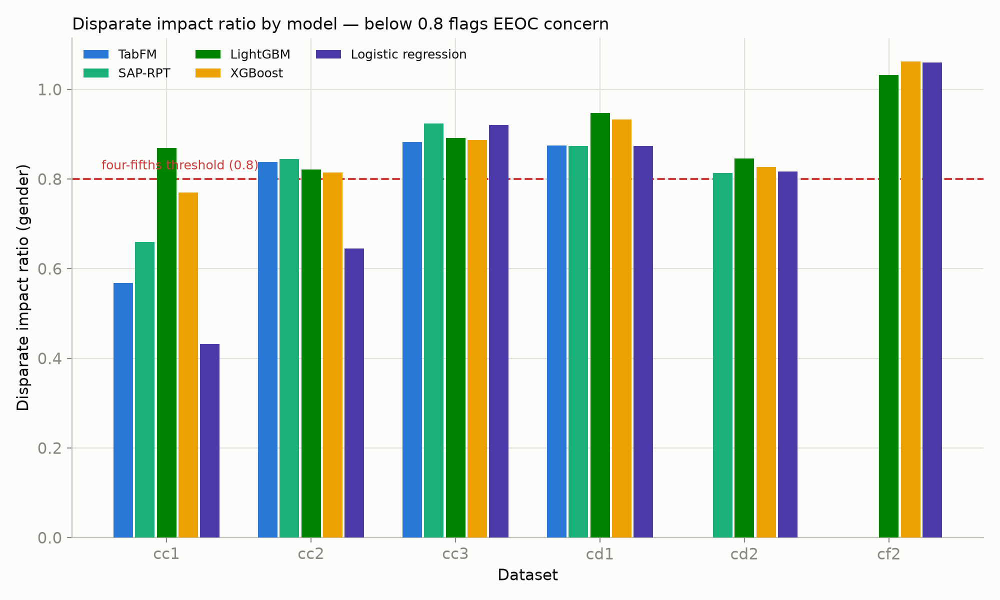
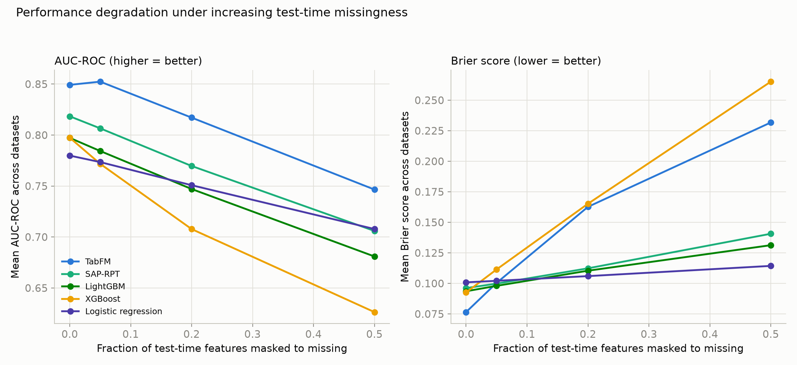
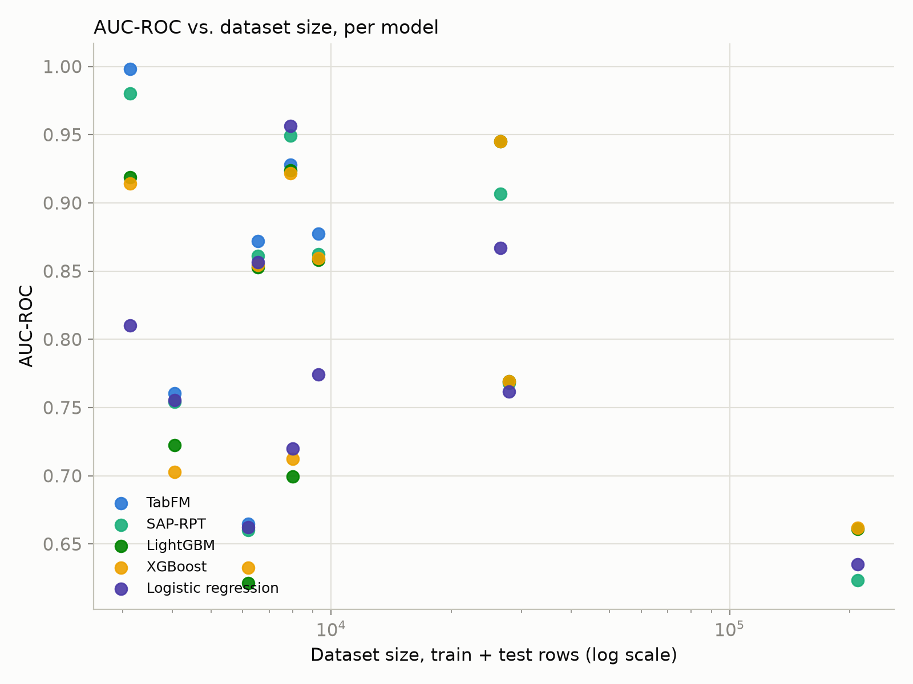

# Zero-Shot Tabular Foundation Models on Financial Risk: A Benchmark of TabFM and SAP-RPT Against Tuned Classical Machine Learning

**Author:** Anthony Soronnadi
**Repository:** [ConceptualCode/tabfm-financial-risk-benchmark](https://github.com/ConceptualCode/tabfm-financial-risk-benchmark)
**Date:** July 2026

---

## Abstract

Zero-shot tabular foundation models — pretrained transformers that produce predictions on structured data via in-context learning, without task-specific gradient updates — are being positioned as a replacement for classical machine learning in production tabular ML: gradient-boosted trees specifically, in the vendors' own framing, though not identically by both vendors evaluated here. Google's TabFM model card states directly that it "outperforms heavily-tuned supervised baselines including gradient-boosted trees" and requires "no dataset-specific training or hyperparameter tuning." SAP's SAP-RPT (`sap-rpt-1-oss`) does not use "zero-shot" or "no training" language in its own card — it documents a required `.fit()` call — but makes an equally explicit no-preprocessing claim ("no preprocessing is required... any missing values are handled correctly") and positions its performance against other tabular in-context-learning models, not against GBMs directly. This paper treats SAP-RPT as zero-shot on the same empirical basis as TabFM (Section 5.3 measures its `.fit()` call at 0.002 seconds, consistent with context-caching rather than gradient-based training), not on the card's own language; the GBM comparison for SAP-RPT in this paper rests on third-party evaluation (Section 3), not SAP's own marketing. This paper evaluates both against tuned classical machine learning — XGBoost, LightGBM, and logistic regression — on FinBench, a 10-dataset suite spanning credit-card default, loan default, credit-card fraud, and customer-churn prediction. The evaluation investigates eight research questions: zero-shot predictive performance, probability calibration, real inference cost, SHAP explainability feasibility, fair-lending disparate impact, the accuracy of the "zero preprocessing" claim, robustness to test-time missing data, and sensitivity to dataset size. Six of the eight reach a direct conclusion; two — SHAP attribution quality (RQ4) and a clean dataset-size effect (RQ8) — are answered as infeasible to resolve with the data and hardware available, not as a definitive yes or no, and are reported as such rather than forced to a conclusion. On the datasets each model completed, both foundation models exceed tuned classical machine learning — gradient-boosted trees and logistic regression alike — on every ranking and calibration metric measured in aggregate (Section 5.1), though not on every individual dataset: logistic regression outperforms both foundation models on one of the six, `cf1`. That result is dominated by a constraint that has nothing to do with accuracy: as of this writing, neither model's pretrained weights are licensed for commercial use, and 5 of 50 (dataset, model) cells could not be completed at all on a free-tier 16GB GPU, concentrated on the widest datasets. Inference cost per prediction call is three to four orders of magnitude higher than XGBoost and scales with context width rather than tree depth; SHAP is infeasible for TabFM under these hardware constraints and costs up to 71 minutes per dataset for SAP-RPT. Fairness does not track model complexity: logistic regression has the worst fair-lending profile of the five models tested, not the foundation models. The net recommendation is that tuned gradient boosting remains the correct production choice today, not on performance, but because it is the only category of the five evaluated that a team can legally ship, on hardware a team can actually afford, without cost and reliability constraints stacked on top of an unresolved licensing question.

---

## 1. Introduction

Foundation models for tabular data are a distinct claim from foundation models for text or images: the pitch is not "learn a new domain," it is "skip the domain-specific machine learning pipeline entirely." TabFM and SAP-RPT sit in the same architectural category and are evaluated here against the same three-part promise — no task-specific training, no manual feature engineering, and accuracy competitive with or better than a tuned gradient-boosted model (GBM) — but the two vendors do not make that promise with equal directness. TabFM's model card states outright that it "outperforms heavily-tuned supervised baselines including gradient-boosted trees" and needs "no dataset-specific training or hyperparameter tuning." SAP-RPT's card does not use "zero-shot" or "no training" language itself — it documents a required `.fit()` call — but makes an explicit no-preprocessing claim ("no preprocessing is required, column names and cell values are automatically embedded... any missing values are handled correctly") and frames its performance comparison against other tabular in-context-learning models (TabPFN, TabICL, TabuLa-8B), not against GBMs directly. This paper treats SAP-RPT as zero-shot on the strength of what its `.fit()` call actually does — average 0.002 seconds (Section 5.3), consistent with context-caching rather than gradient-based training — not on the card's own marketing language. The GBM comparison for SAP-RPT in this paper draws on the third-party evaluation cited in Section 3. Each part of the shared promise is independently testable regardless of which vendor states it explicitly, and each has direct production consequences: no training changes the cost profile, no feature engineering changes the integration burden, and competitive accuracy is the argument for switching at all. Both vendors state their claim specifically against gradient-boosted trees, but gradient-boosted trees are themselves one instance of a broader category — classical machine learning, models trained from scratch on a team's own data with no pretraining or transfer involved — that also includes logistic regression. This paper tests against that full category, not gradient-boosted trees alone, specifically to check whether any finding is a property of tree ensembles or a property of classical, per-task-trained modeling generally; two results (Sections 5.2, 5.5) turn out to hinge on that distinction.

This paper treats those three claims as three separate empirical questions, rather than one aggregate verdict, and adds five more that follow directly from taking "production-ready" seriously: is the model calibrated, not just accurate; what does "no training" actually cost at inference time; does the standard explainability tool used in regulated lending (SHAP) work on these architectures; do these models encode different fair-lending risk than a classical model trained on your own population; does "zero preprocessing" survive contact with a real, messy dataset; how does each model behave when a fraction of input features is missing at scoring time (a routine production condition, not an edge case); and does any zero-shot advantage hold up as dataset size grows, given that gradient-boosted trees are traditionally assumed to need more data to reach their ceiling.

The evaluation is built on FinBench (`yuweiyin/FinBench`), a 10-dataset suite of real financial binary-classification tasks: two credit-card default datasets, three loan-default datasets, two credit-card fraud datasets, and three customer-churn datasets. FinBench was chosen over a single dataset specifically to prevent the most common failure mode of a foundation-model benchmark — a strong result on one favorable dataset presented as a general finding. Every foundation model in this evaluation is run zero-shot, with no fine-tuning, against classical baselines given realistic production-grade preprocessing (not deliberately weakened comparisons).

The deliverable is a decision framework for choosing among these five models under real operational constraints — cost, memory, licensing, fairness, and robustness to missing data, alongside accuracy — grounded in what actually happened when these models were run under realistic hardware and licensing constraints, including the failures. Section 7 turns that framework into three concrete recommendations addressed to three different production situations.

---

## 2. Production Constraint: Licensing

Before any benchmark result in this paper matters, both foundation models carry a checkpoint-level restriction that blocks commercial deployment outright, independent of performance:

| | Code license | Pretrained weights license |
|---|---|---|
| **TabFM** | Apache 2.0 (permissive) | **TabFM Non-Commercial License v1.0** |
| **SAP-RPT** | Apache 2.0 (permissive) | **Research-only** (inherited from the T4/TabLib training-data lineage) |

This was confirmed against both HuggingFace model cards and both underlying repositories (`google-research/tabfm`, `SAP-samples/sap-rpt-1-oss`). The permissive code license is not a mitigating factor: neither model has any function without its pretrained checkpoint, and retraining an equivalent model from scratch on properly licensed data eliminates the entire "zero-shot, no training" value proposition this category is built on. XGBoost, LightGBM, and logistic regression carry no such restriction — a team trains on its own data and owns the resulting model outright.

**Consequence:** regardless of the benchmark results that follow, neither TabFM nor SAP-RPT can be legally deployed in a commercial financial product today. A team would need to either negotiate separate commercial licensing directly with Google or SAP, or train an equivalent architecture from scratch on properly licensed data — a materially different project than "adopt a pretrained checkpoint." This benchmark project itself operates squarely within the research-use exemption of both licenses; a live production system serving real customer decisions is exactly the scenario the license would block. Every result below should be read with this constraint held fixed in the background — it is a hard gate, not a factor to be traded off against accuracy.

---

## 3. Related Work

This is a fast-moving space — TabFM's public release preceded this project by roughly a week — and parts of the space it occupies are already covered elsewhere:

- ["Evaluating SAP RPT-1 for Enterprise Business Process Prediction"](https://arxiv.org/abs/2602.19237) (Lal, 2026, solo-authored, Microsoft) benchmarks SAP-RPT-1-OSS against tuned XGBoost, LightGBM, and CatBoost on SAP's own internal financial-risk business scenarios. RQ1's SAP-RPT-vs-GBM comparison overlaps with that work in question, though not in dataset: this paper uses FinBench, an independent, reproducible academic benchmark, rather than SAP's internal scenarios, and evaluates SAP-RPT alongside a second, independently built foundation model rather than in isolation. That paper's headline result runs in the opposite direction from this one: Lal reports RPT-1 reaching only 91–96% of tuned GBDT accuracy (a 3.6–4.1 percentage-point AUC-ROC gap), while this paper finds SAP-RPT exceeding both GBMs by a comparable margin on FinBench (Section 5.1) — a genuine, unresolved discrepancy between the two evaluations, not a rounding difference. Neither paper isolates which property of its dataset (feature type, class balance, task structure) drives the reversal; this is an open question, not a settled one.
- ["High Performance, Low Reliability: Uncertainty Benchmarking for Tabular Foundation Models"](https://arxiv.org/pdf/2605.28554) already covers calibration and uncertainty benchmarking for tabular foundation models generally. RQ2 in this paper is scoped to a direct, concrete calibration measurement on FinBench specifically, not a general survey of the calibration literature.
- Explainability critiques of TabFM-class models already exist in the community, including a proposed purpose-built architecture (ShapPFN) that integrates Shapley-value computation directly into the model rather than treating it as a post-hoc add-on. RQ4 in this paper is accordingly framed as "does standard SHAP tooling transfer to these two specific models on financial risk data" — a feasibility and cost question — rather than a claim that explainability of tabular foundation models is an unexplored problem.

What is a genuinely distinctive combination, and not duplicated in the sources above: evaluating both foundation models together (not one in isolation) on FinBench specifically, the licensing finding in Section 2, and RQ5 through RQ8 (fair-lending comparison, the "zero preprocessing" honesty finding, missing-data robustness, and dataset-size sensitivity) — none of which turned up in a direct search of the current literature on either model.

---

## 4. Methodology

### 4.1 Datasets

All 10 FinBench configurations were used, none held out:

| Config | Task | Rows (train+test) | Features | Categorical | Numeric |
|---|---|---:|---:|---:|---:|
| `cd1` | Credit-card default | 4,043 | 9 | 4 | 5 |
| `cd2` | Credit-card default | 27,900 | 23 | 9 | 14 |
| `ld1` | Loan default | 3,128 | 12 | 2 | 10 |
| `ld2` | Loan default | 26,633 | 11 | 4 | 7 |
| `ld3` | Loan default | 209,708 | 35 | 2 | 33 |
| `cf1` | Credit-card fraud | 7,902 | 19 | 2 | 17 |
| `cf2` | Credit-card fraud | 7,999 | 120 | 16 | 104 |
| `cc1` | Customer churn | 6,184 | 9 | 4 | 5 |
| `cc2` | Customer churn | 9,300 | 10 | 2 | 8 |
| `cc3` | Customer churn | 6,550 | 21 | 16 | 5 |

Row counts span roughly two orders of magnitude (3,128 to 209,708) and feature counts span more than one order of magnitude (9 to 120) — the range this paper's dataset-size and cost-scaling analyses (RQ3, RQ8) depend on.

### 4.2 Models

Two zero-shot foundation models, evaluated with no fine-tuning:

- **TabFM** (`google/tabfm-1.0.0-pytorch`) — a ~6.5GB checkpoint, ensemble size (`n_estimators`) defaulting to 32 at inference. Trained on synthetic, SCM-generated tabular data.
- **SAP-RPT** (`SAP/sap-rpt-1-oss`) — a ~65MB checkpoint, with `bagging` and `max_context_size` inference-time parameters. Trained on real-world scraped tabular data (T4/TabLib lineage). Access to the checkpoint requires HuggingFace gated-repo approval.

Three classical baselines, each given realistic production-grade preprocessing rather than a deliberately weak comparison. All three are trained from scratch on FinBench directly — no pretraining or transfer of any kind — which is the property that groups them as "classical machine learning" against the two zero-shot foundation models, regardless of internal complexity:

- **XGBoost** — native categorical support, fixed random seed.
- **LightGBM** — native categorical support via a categorical-aware wrapper, fixed random seed.
- **Logistic regression** — one-hot encoded categoricals, standard-scaled numerics, `SimpleImputer` upstream (required for the RQ7 robustness test's injected missingness), fixed random seed. Included as the simplest, lowest-complexity representative of the classical category — not as a production candidate in its own right — specifically to test whether any finding attributed to "classical ML" in this paper is actually a property of tree ensembles rather than of classical, per-task-trained modeling generally.

CatBoost was not included as a third GBM: XGBoost and LightGBM already provide two independently implemented gradient-boosting libraries with different categorical-handling strategies, and a third GBM library was judged unlikely to change the classical-ML comparison meaningfully given how closely XGBoost and LightGBM already track each other across this benchmark (Section 5.1, Appendix A).

Foundation models were fed raw, native-format input — real column names and real category string values — matching how both model cards document intended production usage, not the same pre-encoded numeric array given to the classical baselines. This distinction is the basis of RQ6.

### 4.3 Protocol and hardware

A single train/test split per FinBench config (the split FinBench ships with) was used for every model; there is no bootstrap or repeated-run confidence interval in this pass (see Section 6, Limitations). All foundation-model runs, and the cost/memory measurements reported in RQ3, executed on a free-tier Google Colab T4 GPU (16GB VRAM). This is a hardware-dependent choice: absolute failure thresholds (which datasets OOM) are specific to a 16GB card; the *relative* cost ordering between architectures is not expected to change on larger hardware, only the point at which failures start.

### 4.4 Metrics

- **Ranking/accuracy:** AUC-ROC, PR-AUC, recall, F1 (at the cost-minimizing threshold, not a fixed 0.5 cutoff).
- **Calibration:** log-loss, Brier score, and a 10-bin reliability curve (mean predicted probability vs. observed positive rate per bin).
- **Cost:** wall-clock fit time, wall-clock full-test-set predict time, peak memory during fit and predict.
- **Economic:** a cost-weighted score with an explicit threshold sweep to find the cost-minimizing operating point per model per dataset, rather than assuming 0.5 is the right cutoff for an imbalanced financial-risk task.
- **Explainability:** SHAP feasibility (does it complete, at what cost) and, where it completes, cross-model rank agreement on feature attributions.
- **Fairness:** disparate impact ratio (US EEOC four-fifths rule — a ratio below 0.8 flags regulatory concern) and equalized-odds gap, computed on the 6 FinBench configs with a clean binary `gender` protected attribute.
- **Robustness:** AUC-ROC and Brier score at 0%, 5%, 20%, and 50% of test-time features masked to missing, training data held intact.

---

## 5. Results

Of the 50 possible (dataset, model) cells for the two foundation models across 10 datasets (25 cells each), 39 completed; combined with the classical baselines' full 30/30 completion, 45 of 50 (dataset × model) pairs across all five models are present in the full results table (Appendix A). The 5 gaps are all foundation-model failures, not baseline failures: `tabfm` failed on `cd2`, `cf2`, `ld2`, `ld3` (CUDA out-of-memory), and `sap_rpt` failed on `cf2` (a data-integrity failure, covered in RQ6, not a memory failure). These gaps are treated as findings in their own right throughout this section, not filtered out.

### 5.1 RQ1 — How do TabFM and SAP-RPT's zero-shot performance compare to tuned classical machine learning (XGBoost, LightGBM, logistic regression)?

On the 6 datasets TabFM completed (`cd1`, `ld1`, `cf1`, `cc1`, `cc2`, `cc3`), both foundation models outperform both tuned GBMs and logistic regression on every ranking and calibration metric measured:

| Model | AUC-ROC | PR-AUC | Log-loss | Brier score | Recall | F1 |
|---|---:|---:|---:|---:|---:|---:|
| TabFM | 0.850 | 0.630 | 0.247 | 0.076 | 0.461 | 0.498 |
| SAP-RPT | 0.845 | 0.594 | 0.263 | 0.081 | 0.291 | 0.367 |
| LightGBM | 0.816 | 0.558 | 0.306 | 0.087 | 0.366 | 0.461 |
| XGBoost | 0.814 | 0.542 | 0.285 | 0.086 | 0.339 | 0.430 |
| Logistic regression | 0.803 | 0.494 | 0.297 | 0.091 | 0.283 | 0.362 |

This is not a dataset-selection artifact favoring the foundation models: on this same 6-dataset subset, the GBMs' own AUC-ROC (XGBoost 0.814, LightGBM 0.816) exceeds their AUC-ROC on the full 10-dataset set (XGBoost 0.797, LightGBM 0.797) — the subset is measurably easier for every model tested, GBMs included, not selectively flattering to the foundation models.

Recall is the metric where the gap is largest and most consistent: TabFM's mean recall (0.461, at each dataset's own cost-minimizing threshold) is 26–63% higher than every other model's (26% above LightGBM, 36% above XGBoost, 58% above SAP-RPT, 63% above logistic regression). In a credit-risk or fraud context, recall on the positive (default/fraud) class is usually the operationally important number — the cost of a missed default or missed fraud case is typically far higher than a false positive, which is exactly why this paper's cost-weighted threshold (Section 4.4) rather than a fixed 0.5 cutoff is used throughout.

Per-dataset detail (full 45-row table) is in Appendix A. The ranking above is not uniform across all 6 completed datasets — `cf1` (fraud) is the one dataset where logistic regression's AUC-ROC (0.956) exceeds both foundation models', and `ld1` is the dataset with the largest foundation-model advantage (TabFM 0.998, SAP-RPT 0.980, vs. 0.914–0.919 for the GBMs) — but the aggregate holds directionally across the subset.

TabFM's 4 failures (`cd2`, `cf2`, `ld2`, `ld3`) are covered in RQ3 and RQ8: they are concentrated on datasets that are either wide (`cf2`, 120 features) or have a large training set (`cd2`, `ld2`, `ld3`, all above 26,000 rows), consistent with in-context learning's memory cost scaling with context size rather than model depth.

### 5.2 RQ2 — Are TabFM and SAP-RPT well-calibrated, or do they need post-hoc calibration?

AUC-ROC measures whether a model ranks risky cases above safe ones; it says nothing about whether a predicted probability of 0.73 means 73% of those cases actually default. In finance, calibration is the property risk pricing and capital-reserve decisions are built on, and a model can rank well while its actual probability outputs are unusable for anything beyond ranking.

Mean Expected Calibration Error (ECE — mean absolute gap between predicted and observed rate across the 10 reliability bins) across every dataset each model completed:

| Model | Mean ECE | Datasets |
|---|---:|---:|
| TabFM | 0.0139 | 6 |
| Logistic regression | 0.0172 | 10 |
| SAP-RPT | 0.0192 | 9 |
| XGBoost | 0.0246 | 10 |
| LightGBM | 0.0302 | 10 |

TabFM is the best-calibrated model measured, not merely the best-ranking one — its ECE is roughly half of LightGBM's. This is a genuinely counter-intuitive result: LightGBM, an established, widely deployed production model class, is the *worst*-calibrated model in this evaluation on raw ECE, worse than a linear model and worse than both zero-shot transformers. GBM probability outputs are known in the broader ML literature to require post-hoc recalibration (Platt scaling, isotonic regression) before being trusted as literal probabilities; this result is consistent with that prior, not a new finding, but it means any production comparison that stops at AUC-ROC would have reached the wrong conclusion about which model's raw probability outputs are more trustworthy.

The reliability diagram below is drawn from `cd1`, the one dataset where all five models completed and can be compared directly on the same axes:

Every model on `cd1` sits below the diagonal at the high end of the predicted-probability range (i.e., every model is somewhat overconfident on its highest-risk predictions) — LightGBM and XGBoost show the largest gap at the top bin, consistent with their higher aggregate ECE above. TabFM's curve tracks the diagonal most closely across the full range, including the top bin.

Per-dataset ECE is not uniform (full table in Appendix A) — `cc1` is the dataset with the largest spread between models (LightGBM 0.066 vs. TabFM 0.021), while `cf1` is well-calibrated for every model (0.002–0.005 range). The aggregate ranking above should be read as directional given the single-split protocol (Section 6), not as a proof that TabFM is calibration-superior on any specific unseen dataset.

### 5.3 RQ3 — What's the real inference cost of in-context learning vs. tuned classical machine learning?

This is the direct test of "zero-shot" as a cost claim, not just an accuracy claim. TabFM's `fit()` call averages 0.36 seconds because it performs no gradient-based training at all — the training set is retained as in-context examples and processed at inference time instead. SAP-RPT's `fit()` averages 0.002 seconds for the same reason. Mean wall-clock time across every dataset each model completed:

| Model | Mean fit time | Mean predict time (full test set) | Mean peak predict memory |
|---|---:|---:|---:|
| Logistic regression | 0.48s | 0.048s | 8.9 MB |
| XGBoost | 1.23s | 0.057s | 0.16 MB |
| LightGBM | 1.44s | 0.172s | 0.33 MB |
| SAP-RPT | 0.002s | 55.2s | 7.3 MB |
| TabFM | 0.36s | 362s | 51.2 MB |

Per-dataset, TabFM's prediction time is 17,000×–35,000× XGBoost's; SAP-RPT's is 264×–1,107×, and the ratio for SAP-RPT rises directly with column count (264× at 9 columns on `cc1`, 1,107× at 35 columns on `ld3`). Prediction time for both foundation models scales with dataset width and training-set size, not with output complexity — the opposite of a GBM, whose inference cost is governed by tree depth and is nearly flat across the widths and row counts tested here.

SAP-RPT's specific sensitivity to column count, not just row count, has an architectural explanation rather than being an unexplained correlation. SAP-RPT is built on 2D attention — separate cross-row and cross-column attention passes over the table, not a single flat sequence — with every cell value and column name additionally passed through a sentence-transformer embedding step (`all-MiniLM-L6-v2`) before the core transformer runs, and `bagging=8` replicating that computation roughly 8x. A model attending over rows alone would not be nearly this sensitive to width; a genuinely two-dimensional attention scheme over a rows × columns grid is. This mechanism is documented at a source level in [GitHub issue #1](https://github.com/ConceptualCode/tabfm-financial-risk-benchmark/issues/1) of this project's repository, based on SAP's public architecture documentation rather than SAP-RPT's own source code, which was not inspected directly.

This scaling is the direct, observed cause of TabFM's 4 dataset failures. `cf2` (120 features, the widest FinBench dataset) failed for both foundation models — TabFM with a CUDA out-of-memory error during the main prediction step, SAP-RPT with the dtype crash covered in RQ6 (a different failure mode, on the same dataset). TabFM's own model card states it is "optimised for tables up to 500 features"; `cf2`'s 120 columns are well inside that stated range, and it still OOM'd on a 16GB GPU at the library's default ensemble size. `cd2`, `ld2`, and `ld3` — all above 26,000 rows — failed for TabFM specifically with out-of-memory errors during the main metrics step on a 16GB T4, even at the library's default ensemble size. These are not edge-case datasets; they are three of the ten datasets in a standard financial-risk benchmark suite, meaning roughly 40% of TabFM's failures on this benchmark are directly attributable to inference-time memory scaling, not to any accuracy limitation.

The practical framing: zero-shot eliminates *training* cost. It does not eliminate *compute* cost — it relocates the cost to inference, at a total that is substantially higher than the training-plus-inference cost of the model it is meant to replace, and that relocation is what caused four of ten evaluation failures on affordable hardware.

### 5.4 RQ4 — Does SHAP work on TabFM and SAP-RPT the way it does on GBMs?

SHAP (SHapley Additive exPlanations) is the standard explainability tool in regulated lending: US Equal Credit Opportunity Act adverse-action requirements mean a lender must give a specific, per-applicant reason for a credit denial, and SHAP is what generates that reason from an otherwise black-box model by attributing a signed contribution to each input feature for each individual prediction. Whether it transfers cleanly to an in-context-learning transformer, an architecture SHAP's tooling was not originally designed around, is a direct production-adoption question, not a theoretical one.

SHAP's cost compounds RQ3's finding rather than introducing a new mechanism: `KernelExplainer` requires hundreds of individual prediction calls per explained instance. At TabFM's per-call cost (Section 5.3), this is not merely a slower operation — it is infeasible on the hardware available for this evaluation. TabFM's SHAP step produced an out-of-memory error on every dataset tested, including after reducing the inference ensemble size 8× specifically for the SHAP step (from the library default of 32 down to 4) and even at the theoretical minimum ensemble size of 1 on a smaller 8GB GPU tested separately. SAP-RPT's SHAP step completed on every dataset it was run against, but required 45–71 minutes per dataset — against a runtime of seconds for both GBMs on the same explanation task.

The answer to RQ4, established through direct experience rather than a planned ablation: SHAP is either infeasible or prohibitively expensive for both models on realistic, affordable hardware. This is a distinct finding from "SHAP's mathematical assumptions don't hold for these architectures" — this evaluation did not reach the question of attribution *quality*, only feasibility and cost, because cost alone was already prohibitive. Whether SAP-RPT's SHAP output, on the datasets where it did complete, is stable and trustworthy rather than noisy is deferred (Section 6) pending a hardware budget this evaluation did not have.

One partial data point exists on cross-model attribution agreement, computed only on `cd1` (the one dataset where the comparison was captured across GBMs, logistic regression, and SAP-RPT before the compute cost above became prohibitive for a full sweep) — full table in Appendix D. SAP-RPT and XGBoost's SHAP rankings agree at 0.751 (Spearman rank correlation across mean absolute SHAP values by feature); SAP-RPT and LightGBM agree at 0.612; the two GBMs agree with each other at 0.758 — meaning SAP-RPT's feature-attribution agreement with either GBM is roughly comparable to the GBMs' agreement with each other, a mild positive signal on `cd1` specifically, not a general claim. TabFM does not appear in this table: by the time TabFM's SHAP step was made to complete at all (via the ensemble-size reduction above), the compute budget for extending the cross-model comparison to include it was not available. This gap is itself a limitation, not an omission — see Section 6.

### 5.5 RQ5 — Do TabFM and SAP-RPT encode different bias patterns than a classical model trained on your own data?

TabFM is trained on synthetic, structural-causal-model-generated data; SAP-RPT is trained on real-world scraped tables (T4/TabLib); each classical baseline in this evaluation — gradient-boosted or linear — is trained fresh, only on the FinBench population itself. Whether those different training corpora produce different fair-lending outcomes — not just different accuracy — is untested in the related work surveyed in Section 3, each of which evaluates a single model's performance rather than cross-model bias comparison.

Evaluated via disparate impact ratio (EEOC four-fifths rule: a ratio under 0.8 flags regulatory concern) and equalized-odds gap, on the 6 FinBench configs with a clean binary `gender` protected attribute (`cc1`, `cc2`, `cc3`, `cd1`, `cd2`, `cf2`):

| Model | Datasets checked | Flagged (<0.8) | Mean disparate impact ratio | Mean equalized-odds gap |
|---|---:|---:|---:|---:|
| LightGBM | 6 | 0 | 0.901 | 0.061 |
| XGBoost | 6 | 1 | 0.882 | 0.087 |
| SAP-RPT | 5 | 1 | 0.823 | 0.102 |
| TabFM | 4 | 1 | 0.791 | 0.158 |
| Logistic regression | 6 | 2 | 0.792 | 0.169 |

Two results stand out. First, `cc1` (customer churn) is the dataset that produced a disparate-impact violation for every model tested except LightGBM — logistic regression's ratio on `cc1` (0.432) is roughly half the regulatory floor, the single worst result in the entire fairness audit. Second, and more directly relevant to the "does model complexity change fairness" question this RQ asks: logistic regression, the simplest model in this evaluation, has the *worst* aggregate fairness profile of the five models — 2 of 6 datasets flagged (tied for most) and the highest mean equalized-odds gap. TabFM's mean equalized-odds gap (0.158) is the second-highest, but based on only 4 of 6 datasets (the other 2 failed for the memory reasons in RQ3), so this specific ranking should be read as directional rather than conclusive given the smaller sample.

The finding that survives across both the disparate-impact and equalized-odds views: model simplicity does not correlate with fairness in this evaluation. A linear model encodes the same population disparity as a more complex model, just through a coefficient rather than a split or an attention pattern, and here the simplest model available failed the fairness check worst, not the two black-box foundation models a fair-lending reviewer would instinctively scrutinize hardest. Passing an accuracy benchmark, or being technically explainable via SHAP, does not establish fairness — it is a separate, independent check, and in this evaluation the model that would be assumed "safest" by virtue of being interpretable is the one that failed it most.

### 5.6 RQ6 — Is the "zero preprocessing needed" pitch actually true in practice?

Both foundation models are marketed on skipping manual feature engineering, though with different explicitness: SAP-RPT's card states it outright — "no preprocessing is required, column names and cell values are automatically embedded"; TabFM's card does not make the claim in those words, but its documented usage passes a raw DataFrame directly with no preprocessing step shown, and its "no dataset-specific training or hyperparameter tuning" claim implies the same production pitch. Either way, the practical claim being tested is: feed raw data, no one-hot encoding or manual scaling required. `cf2` (credit-card fraud, 120 features) surfaced a real, concrete counter-example to that pitch during this evaluation, not a constructed edge case: `cf2`'s own upstream metadata contains two distinct source columns that collapsed to an identical human-readable name during preprocessing — an ordinary, common data-quality issue in real-world feature stores, not something engineered to break the model.

Feeding `cf2` to either foundation model in its documented raw format produced an identical crash on both: `AttributeError: 'DataFrame' object has no attribute 'dtype'`. The root cause is internal column lookup by name inside each model's own preprocessing code — a name-based lookup against a duplicate column name returns a DataFrame slice (multiple columns) rather than a single Series, and neither model's internal code branches to handle that case. Neither model card documents this as a constraint. Both foundation models are missing complete results on `cf2` as a direct consequence (TabFM additionally OOMs on `cf2` independent of this issue, per RQ3, since it is also the widest dataset in the suite); every classical baseline, which performs no name-based column lookups internally, ran on `cf2` without incident.

Two further, independent defects surfaced while implementing the raw-input path required to feed these models correctly, both silent rather than error-raising:

1. A numeric column reconstructed via positional (not name-based) DataFrame indexing silently retained `dtype=object` rather than a numeric dtype, because assigning into `.iloc` column positions does not change the underlying block dtype in pandas — this required an explicit per-column `Series` reconstruction to fix.
2. The same class of silent dtype loss recurred inside `shap.KernelExplainer` itself, which internally flattens a typed DataFrame into a single-dtype NumPy array before invoking the model being explained — requiring a wrapper that reconstructs a properly typed DataFrame from the flattened array before every call into the model during SHAP's perturbation sampling.

Neither defect raised an exception at the time it occurred; both would have silently fed incorrectly typed data into the model, producing plausible but wrong predictions, had they not been caught by manual inspection of intermediate DataFrame dtypes.

**The finding:** "no manual feature engineering" is an accurate and genuinely valuable claim — a team does not need to hand-encode categorical variables or scale numeric ones for either model. "No engineering effort" is a different claim, and it is not true. The effort does not disappear; it moves from building a conventional preprocessing pipeline to debugging silent, undocumented failure modes in a code path the model card does not describe as fragile. A team adopting either model should budget real engineering time for this class of problem, not assume "raw input" means "no integration work."

### 5.7 RQ7 — How gracefully does each model handle incomplete data at prediction time?

Real applicants and transactions in production frequently arrive with incomplete profiles: a field was not collected, a system did not report a value in time. SAP-RPT's model card explicitly advertises automatic missing-value handling ("any missing values are handled correctly"); TabFM's card makes no claim either way on missing data, and this test was run on it regardless, as a fair question to ask of any model marketed for raw, unprocessed input (Section 5.6). XGBoost and LightGBM also handle missing values natively via learned split directions, and logistic regression was given an explicit imputer for this test specifically (Section 4.2) since it has no native missing-value handling. Each model was trained once, on clean data, then evaluated repeatedly against the same test set with an increasing fraction of *test-time only* features masked to missing (0%, 5%, 20%, 50%) — isolating "does this model degrade gracefully at scoring time" from "can this model be trained on incomplete data," a different question not tested here.

Mean AUC-ROC across datasets, by model and missing rate:

| Model | 0% | 5% | 20% | 50% | AUC drop, 0→50% |
|---|---:|---:|---:|---:|---:|
| TabFM | 0.849 | 0.852 | 0.817 | 0.747 | −0.102 |
| SAP-RPT | 0.818 | 0.807 | 0.770 | 0.706 | −0.112 |
| Logistic regression | 0.780 | 0.774 | 0.751 | 0.708 | −0.072 |
| LightGBM | 0.797 | 0.784 | 0.747 | 0.681 | −0.116 |
| XGBoost | 0.797 | 0.772 | 0.708 | 0.626 | −0.171 |

Mean Brier score (lower is better) by the same grid:

| Model | 0% | 5% | 20% | 50% | Brier increase, 0→50% |
|---|---:|---:|---:|---:|---:|
| TabFM | 0.077 | 0.100 | 0.163 | 0.232 | +0.155 |
| SAP-RPT | 0.096 | 0.100 | 0.112 | 0.141 | +0.045 |
| LightGBM | 0.094 | 0.098 | 0.110 | 0.131 | +0.038 |
| Logistic regression | 0.101 | 0.102 | 0.106 | 0.114 | +0.014 |
| XGBoost | 0.093 | 0.111 | 0.165 | 0.265 | +0.152 |

These two views tell different stories, and the disagreement between them is the finding. On AUC-ROC, XGBoost degrades roughly 65% faster than LightGBM (a 0.171 drop vs. 0.116) despite both claiming the same native missing-value handling mechanism — "handles missing data" is not a single, uniform property even between architecturally similar GBMs from different libraries. On Brier score, the picture inverts: TabFM starts as the best-calibrated model under clean data (Section 5.2) but its calibration collapses fastest under missingness, with a Brier increase (+0.155) essentially tied with XGBoost's (+0.152) and roughly 3–4× logistic regression's (+0.014). TabFM's *ranking* (AUC-ROC) degrades more gracefully than XGBoost's, but its *calibration* degrades just as badly — a model can hold its ranking ability under missingness while its probability outputs stop meaning what they claim to mean, which matters directly for any downstream system (pricing, reserving) that consumes the probability value rather than just the rank.

Logistic regression, given only a standard imputer and no special handling, has the smallest Brier degradation of any model tested (+0.014) — the imputer's mean/mode fill is a crude strategy, but it produces predictable, bounded probability drift, whereas the foundation models' and GBMs' more sophisticated missing-value handling produces larger swings under the same test. Coverage caveat: TabFM's robustness numbers reflect only the 6 datasets it could be fit on at all (Section 5.1); SAP-RPT's reflect 9 of 10 (missing `cf2`, per RQ6).

### 5.8 RQ8 — Does the zero-shot "advantage" shrink as dataset size grows?

Zero-shot in-context learning is commonly assumed to have its largest edge on small datasets, where gradient-boosted trees have less data to learn stable splits from; TabFM's own model card notes memory scaling with training row count as a real constraint, which RQ3 already confirmed empirically. This question asks whether the *accuracy* advantage specifically tracks dataset size, using the results already collected for RQ1 — no additional infrastructure was needed.

The relationship is not monotonic for any model, and is dominated by per-task difficulty rather than row count. The two smallest datasets (`ld1`, 3,128 rows; `cd1`, 4,043 rows) span nearly the full AUC-ROC range seen anywhere in the benchmark: `ld1` is the easiest dataset for every model (TabFM 0.998, SAP-RPT 0.980, GBMs 0.914–0.919), while `cd1` is one of the harder ones (TabFM 0.761, GBMs 0.703–0.723) — two datasets of similar, small size, with a roughly 25-point AUC-ROC spread between them for the same models. At the largest end, `ld3` (209,708 rows) is the single hardest dataset in the suite for every model that completed it (0.624–0.662 AUC-ROC across XGBoost, LightGBM, logistic regression, and SAP-RPT), which is at minimum consistent with the traditional expectation that GBMs do not gain a further edge at this scale over the alternatives available — though the harder task, not necessarily the larger row count, may be the operative variable, since `ld3` is also FinBench's most imbalanced task by recall (all models score below 0.03 recall at their cost-minimizing threshold, Appendix A).

The clearest test of the "size erodes the zero-shot edge" hypothesis specifically is the set of datasets TabFM failed on outright: `cd2` (27,900 rows), `ld2` (26,633 rows), and `ld3` (209,708 rows) are three of the four largest datasets in the suite by row count, and TabFM could not produce a result on any of them at all, on the hardware available. This is a stronger form of "the advantage shrinks with size" than a gradual accuracy decline — it is a hard availability cutoff, and it occurs well before the point where a gradual erosion in relative accuracy could even be measured. SAP-RPT, with a far smaller checkpoint and different memory profile (RQ3), completed all three of these large datasets, with AUC-ROC (0.769, 0.907, 0.623 respectively) close to but not exceeding the GBMs' on the same three datasets (0.769/0.945/0.662 for XGBoost).

The honest answer to RQ8: this data does not support a clean "zero-shot advantage shrinks smoothly with size" narrative, because task difficulty varies independently of size across FinBench's 10 datasets and swamps any size effect in the accuracy numbers themselves. What the data does support is a harder, more actionable version of the same concern — for TabFM specifically, size (in combination with width, per RQ3) determines whether a result exists at all, before the question of whether its accuracy is competitive can even be asked.

---

## 6. Limitations

- **Coverage:** 45 of 50 (dataset, model) combinations completed. The 5 gaps are foundation-model-only, attributable either to the 16GB GPU memory ceiling (`tabfm` on `cd2`, `ld2`, `ld3`) or the duplicate-column defect in Section 5.6 (`tabfm` and `sap_rpt`, both on `cf2`).
- **Single split, no confidence intervals:** every result is a single train/test split per dataset, with no bootstrap resampling. Close rankings (e.g., XGBoost vs. LightGBM's near-identical full-suite AUC-ROC, 0.7974 vs. 0.7973) should be read as directional, not as a statistically confirmed ordering.
- **SHAP evaluated for feasibility and cost, not attribution stability or quality.** The cross-model rank-agreement data in Appendix D covers `cd1` only, and does not include TabFM (Section 5.4) — this is a real gap in this pass, not a rounding-down of a fuller comparison.
- **No repeated-call consistency check.** SAP-RPT's `bagging` parameter introduces randomness into inference; whether repeated scoring of the same applicant on the same day produces a materially different score was not tested, and is a real fair-lending and audit-trail question for a production deployment.
- **Single hardware configuration.** All foundation-model and cost results reflect a free-tier Colab T4 (16GB VRAM). The relative cost ordering between architectures (Section 5.3) should generalize to other hardware; the specific datasets that OOM will not — a larger GPU shifts the failure boundary in Sections 5.1, 5.3, and 5.8, it does not remove the underlying scaling relationship.
- **Research-use exemption.** This entire evaluation was conducted under the research-use exemption of both models' licenses (Section 2). Production deployment is the scenario this paper's recommendation addresses; it is explicitly not the scenario this project itself operates under.
- **RQ8's size effect is confounded with task difficulty**, as discussed in Section 5.8 — FinBench's 10 datasets were not constructed as a controlled size ablation, and this paper does not claim to have isolated a pure size effect from a task-difficulty effect.

---

## 7. Discussion and Production Recommendation

Absent Section 2's licensing constraint, this would be a genuine trade-off rather than a one-sided result. Both foundation models outperformed both tuned GBMs on every accuracy and calibration metric, on every dataset either completed (Sections 5.1, 5.2) — that is a real result, not an artifact of dataset selection, and it should inform how this category is tracked going forward. That performance is not free, and the cost is not one that can be tuned away after the fact: 17,000×–35,000× higher per-prediction inference cost than XGBoost (Section 5.3), a memory ceiling that made 4 of 10 datasets entirely unrunnable for TabFM on affordable hardware (Sections 5.1, 5.3, 5.8), and an explainability step that is either infeasible (TabFM) or costs up to 71 minutes per dataset (SAP-RPT) against seconds for either GBM (Section 5.4). Add the fairness result — the simplest model tested, not either foundation model, had the worst fair-lending profile (Section 5.5) — and the accurate summary of the performance case alone is: more accurate, substantially more expensive, and less production-ready on every operational axis than the "zero-shot, zero-effort" pitch suggests.

None of that is actually the deciding factor. **Neither model can be legally deployed in a commercial product today** (Section 2). A model that cannot be shipped is a research artifact, not a production option, and every performance number in this paper is a measurement of a research artifact's quality, not evidence toward a decision that is currently available to make.

Three concrete recommendations follow, addressed to three different situations:

- **Choosing a model for a production system today:** use tuned XGBoost or LightGBM. Neither carries licensing exposure, both cost three to four orders of magnitude less per prediction than the foundation models tested, and the performance gap (Section 5.1) is real but not disqualifying for most financial-risk use cases — particularly once RQ2's calibration result is accounted for, since LightGBM's raw probability outputs are the least trustworthy of the five models tested and would need post-hoc recalibration regardless of which model class is chosen.
- **Evaluating this category as a strategic bet, not an immediate deployment:** the performance case in Sections 5.1–5.2 justifies continued monitoring of this space and a pilot the moment commercial licensing becomes available from either vendor. The cost and memory findings in Section 5.3 should be treated as a first-class input to that pilot's hardware budget, not a footnote discovered mid-pilot.
- **A team already committed to one of these models under a research license or a negotiated commercial agreement:** budget inference cost as a first-class, ongoing operational constraint rather than a one-time integration cost, and do not assume SHAP is a low-cost addition for regulatory compliance purposes — Section 5.4's finding is that it may not be available at all within a realistic hardware budget, which has direct consequences for ECOA adverse-action-notice obligations in a lending context specifically.

---

## 8. Conclusion

TabFM and SAP-RPT both deliver on the accuracy half of the zero-shot pitch, on the datasets and hardware where they can run at all. They do not deliver on "free" or "effortless": inference cost, memory ceiling, explainability cost, and preprocessing debugging effort are all real, measured costs that the marketing framing of "zero-shot, zero training" does not surface, and the fairness result in this paper is a reminder that neither accuracy nor architectural sophistication is a proxy for fair-lending safety. Layered underneath all of it is a constraint that makes the rest of this paper's findings a matter of technical record rather than a live decision: as of this writing, neither model can be legally deployed in a commercial product. The production recommendation that follows from combining these findings is unambiguous even though the underlying performance trade-off is genuinely close — ship tuned gradient boosting today, track this category closely, and treat the day either vendor offers commercial licensing as the actual start of the production decision this paper's performance numbers were built to inform.

---

## Appendix A: Full Per-Dataset Results

All available (dataset, model) cells. `best_threshold` is the cost-minimizing decision threshold found via the sweep described in Section 4.4; `min_expected_cost` and `cost_at_naive_0.5` are in the same cost units, lower is better. Blank cells indicate the (dataset, model) pair did not complete (Sections 5.1, 5.6).

| Dataset | Model | AUC-ROC | PR-AUC | Log-loss | Brier | Recall | F1 | Best thr. | Min cost | Cost @ 0.5 | Fit (s) | Predict (s) |
|---|---|---:|---:|---:|---:|---:|---:|---:|---:|---:|---:|---:|
| cc1 | lightgbm | 0.621 | 0.319 | 0.536 | 0.175 | 0.121 | 0.188 | 0.13 | 0.703 | 1.021 | 0.395 | 0.039 |
| cc1 | logreg | 0.662 | 0.358 | 0.503 | 0.164 | 0.060 | 0.107 | 0.16 | 0.675 | 1.068 | 0.042 | 0.019 |
| cc1 | sap_rpt | 0.660 | 0.367 | 0.503 | 0.164 | 0.054 | 0.099 | 0.13 | 0.674 | 1.067 | 0.001 | 3.337 |
| cc1 | tabfm | 0.665 | 0.358 | 0.501 | 0.163 | 0.045 | 0.082 | 0.17 | 0.676 | 1.081 | 0.193 | 338.811 |
| cc1 | xgboost | 0.633 | 0.322 | 0.530 | 0.173 | 0.105 | 0.164 | 0.13 | 0.684 | 1.043 | 0.242 | 0.013 |
| cc2 | lightgbm | 0.858 | 0.692 | 0.334 | 0.100 | 0.490 | 0.587 | 0.17 | 0.387 | 0.531 | 1.085 | 0.053 |
| cc2 | logreg | 0.774 | 0.460 | 0.415 | 0.131 | 0.192 | 0.284 | 0.17 | 0.513 | 0.817 | 0.036 | 0.018 |
| cc2 | sap_rpt | 0.863 | 0.698 | 0.329 | 0.099 | 0.442 | 0.566 | 0.17 | 0.393 | 0.566 | 0.001 | 5.529 |
| cc2 | tabfm | 0.878 | 0.727 | 0.310 | 0.093 | 0.510 | 0.614 | 0.22 | 0.367 | 0.506 | 0.279 | 579.931 |
| cc2 | xgboost | 0.860 | 0.695 | 0.330 | 0.099 | 0.485 | 0.585 | 0.18 | 0.380 | 0.535 | 0.370 | 0.017 |
| cc3 | lightgbm | 0.853 | 0.685 | 0.424 | 0.139 | 0.541 | 0.589 | 0.09 | 0.402 | 0.721 | 0.334 | 0.059 |
| cc3 | logreg | 0.857 | 0.685 | 0.412 | 0.134 | 0.600 | 0.637 | 0.17 | 0.390 | 0.636 | 0.084 | 0.030 |
| cc3 | sap_rpt | 0.861 | 0.697 | 0.406 | 0.132 | 0.561 | 0.623 | 0.16 | 0.392 | 0.677 | 0.002 | 8.612 |
| cc3 | tabfm | 0.872 | 0.715 | 0.392 | 0.127 | 0.588 | 0.642 | 0.10 | 0.380 | 0.641 | 0.744 | 399.718 |
| cc3 | xgboost | 0.854 | 0.689 | 0.418 | 0.137 | 0.553 | 0.600 | 0.10 | 0.398 | 0.703 | 0.623 | 0.023 |
| cd1 | lightgbm | 0.723 | 0.144 | 0.290 | 0.064 | 0.062 | 0.094 | 0.28 | 0.291 | 0.307 | 0.233 | 0.028 |
| cd1 | logreg | 0.755 | 0.178 | 0.210 | 0.056 | 0.025 | 0.045 | 0.19 | 0.277 | 0.307 | 0.070 | 0.020 |
| cd1 | sap_rpt | 0.754 | 0.166 | 0.210 | 0.056 | 0.000 | 0.000 | 0.18 | 0.279 | 0.311 | 0.002 | 3.149 |
| cd1 | tabfm | 0.761 | 0.180 | 0.210 | 0.055 | 0.012 | 0.023 | 0.17 | 0.271 | 0.310 | 0.256 | 183.284 |
| cd1 | xgboost | 0.703 | 0.141 | 0.247 | 0.061 | 0.062 | 0.097 | 0.26 | 0.287 | 0.304 | 0.236 | 0.008 |
| cd2 | lightgbm | 0.769 | 0.530 | 0.436 | 0.137 | 0.349 | 0.453 | 0.15 | 0.567 | 0.751 | 1.863 | 0.138 |
| cd2 | logreg | 0.762 | 0.521 | 0.440 | 0.138 | 0.339 | 0.446 | 0.17 | 0.572 | 0.759 | 0.808 | 0.034 |
| cd2 | sap_rpt | 0.768 | 0.512 | 0.437 | 0.138 | 0.307 | 0.415 | 0.15 | 0.561 | 0.792 | 0.002 | 37.384 |
| cd2 | xgboost | 0.769 | 0.534 | 0.436 | 0.137 | 0.371 | 0.471 | 0.13 | 0.564 | 0.729 | 1.319 | 0.047 |
| cf1 | lightgbm | 0.924 | 0.721 | 0.044 | 0.005 | 0.478 | 0.647 | 0.29 | 0.022 | 0.024 | 0.377 | 0.035 |
| cf1 | logreg | 0.956 | 0.759 | 0.017 | 0.004 | 0.565 | 0.703 | 0.08 | 0.014 | 0.020 | 0.088 | 0.024 |
| cf1 | sap_rpt | 0.949 | 0.753 | 0.023 | 0.006 | 0.087 | 0.160 | 0.10 | 0.014 | 0.041 | 0.002 | 9.136 |
| cf1 | tabfm | 0.928 | 0.814 | 0.015 | 0.003 | 0.609 | 0.718 | 0.03 | 0.011 | 0.018 | 0.477 | 514.817 |
| cf1 | xgboost | 0.922 | 0.634 | 0.028 | 0.006 | 0.348 | 0.485 | 0.06 | 0.019 | 0.030 | 0.550 | 0.024 |
| cf2 | lightgbm | 0.700 | 0.138 | 0.280 | 0.058 | 0.000 | 0.000 | 0.05 | 0.291 | 0.303 | 1.979 | 0.062 |
| cf2 | logreg | 0.720 | 0.151 | 0.218 | 0.055 | 0.006 | 0.013 | 0.14 | 0.288 | 0.301 | 0.483 | 0.081 |
| cf2 | xgboost | 0.712 | 0.142 | 0.233 | 0.056 | 0.000 | 0.000 | 0.08 | 0.289 | 0.303 | 2.079 | 0.019 |
| ld1 | lightgbm | 0.919 | 0.784 | 0.210 | 0.041 | 0.505 | 0.662 | 0.03 | 0.150 | 0.225 | 0.332 | 0.025 |
| ld1 | logreg | 0.810 | 0.522 | 0.223 | 0.059 | 0.253 | 0.393 | 0.17 | 0.266 | 0.340 | 0.053 | 0.019 |
| ld1 | sap_rpt | 0.980 | 0.881 | 0.105 | 0.031 | 0.604 | 0.753 | 0.12 | 0.094 | 0.178 | 0.001 | 3.537 |
| ld1 | tabfm | 0.998 | 0.983 | 0.055 | 0.016 | 1.000 | 0.910 | 0.02 | 0.018 | 0.018 | 0.212 | 155.903 |
| ld1 | xgboost | 0.914 | 0.769 | 0.159 | 0.040 | 0.484 | 0.647 | 0.10 | 0.152 | 0.234 | 0.304 | 0.007 |
| ld2 | lightgbm | 0.945 | 0.898 | 0.195 | 0.055 | 0.717 | 0.823 | 0.16 | 0.255 | 0.315 | 0.565 | 0.172 |
| ld2 | logreg | 0.867 | 0.720 | 0.344 | 0.103 | 0.542 | 0.632 | 0.26 | 0.390 | 0.538 | 0.817 | 0.055 |
| ld2 | sap_rpt | 0.907 | 0.842 | 0.261 | 0.073 | 0.661 | 0.767 | 0.24 | 0.331 | 0.384 | 0.002 | 18.907 |
| ld2 | xgboost | 0.945 | 0.899 | 0.197 | 0.055 | 0.716 | 0.823 | 0.17 | 0.252 | 0.316 | 0.575 | 0.044 |
| ld3 | lightgbm | 0.661 | 0.341 | 0.500 | 0.163 | 0.013 | 0.025 | 0.17 | 0.678 | 1.092 | 7.198 | 1.115 |
| ld3 | logreg | 0.635 | 0.316 | 0.508 | 0.165 | 0.004 | 0.009 | 0.17 | 0.702 | 1.099 | 2.366 | 0.176 |
| ld3 | sap_rpt | 0.623 | 0.306 | 0.513 | 0.167 | 0.000 | 0.000 | 0.16 | 0.719 | 1.103 | 0.002 | 407.276 |
| ld3 | xgboost | 0.662 | 0.344 | 0.499 | 0.162 | 0.017 | 0.033 | 0.16 | 0.679 | 1.088 | 6.048 | 0.368 |

---

## Appendix B: Full Robustness Table (Mean Across Datasets, by Missing Rate)

| Model | Missing rate | Mean AUC-ROC | Mean Brier score | Datasets contributing |
|---|---:|---:|---:|---:|
| TabFM | 0.00 | 0.849 | 0.077 | 6 |
| TabFM | 0.05 | 0.852 | 0.100 | 6 |
| TabFM | 0.20 | 0.817 | 0.163 | 6 |
| TabFM | 0.50 | 0.747 | 0.232 | 6 |
| SAP-RPT | 0.00 | 0.818 | 0.096 | 9 |
| SAP-RPT | 0.05 | 0.807 | 0.100 | 9 |
| SAP-RPT | 0.20 | 0.770 | 0.112 | 9 |
| SAP-RPT | 0.50 | 0.706 | 0.141 | 9 |
| LightGBM | 0.00 | 0.797 | 0.094 | 10 |
| LightGBM | 0.05 | 0.784 | 0.098 | 10 |
| LightGBM | 0.20 | 0.747 | 0.110 | 10 |
| LightGBM | 0.50 | 0.681 | 0.131 | 10 |
| XGBoost | 0.00 | 0.797 | 0.093 | 10 |
| XGBoost | 0.05 | 0.772 | 0.111 | 10 |
| XGBoost | 0.20 | 0.708 | 0.165 | 10 |
| XGBoost | 0.50 | 0.626 | 0.265 | 10 |
| Logistic regression | 0.00 | 0.780 | 0.101 | 10 |
| Logistic regression | 0.05 | 0.774 | 0.102 | 10 |
| Logistic regression | 0.20 | 0.751 | 0.106 | 10 |
| Logistic regression | 0.50 | 0.708 | 0.114 | 10 |

---

## Appendix C: Full Fairness Table

Disparate impact ratio below 0.8 flags EEOC four-fifths concern (bold). All on `gender` as the protected attribute.

| Dataset | Model | Disparate impact ratio | Equalized-odds gap | Selection rate (privileged) | Selection rate (unprivileged) |
|---|---|---:|---:|---:|---:|
| cc1 | lightgbm | 0.869 | 0.039 | 0.318 | 0.276 |
| cc1 | logreg | **0.432** | 0.198 | 0.323 | 0.140 |
| cc1 | sap_rpt | **0.660** | 0.067 | 0.185 | 0.122 |
| cc1 | tabfm | **0.568** | 0.193 | 0.465 | 0.264 |
| cc1 | xgboost | **0.770** | 0.075 | 0.331 | 0.255 |
| cc2 | lightgbm | 0.821 | 0.092 | 0.734 | 0.603 |
| cc2 | logreg | **0.646** | 0.219 | 0.633 | 0.409 |
| cc2 | sap_rpt | 0.845 | 0.084 | 0.711 | 0.601 |
| cc2 | tabfm | 0.838 | 0.085 | 0.787 | 0.659 |
| cc2 | xgboost | 0.814 | 0.101 | 0.740 | 0.603 |
| cc3 | lightgbm | 0.892 | 0.054 | 0.461 | 0.411 |
| cc3 | logreg | 0.921 | 0.034 | 0.499 | 0.460 |
| cc3 | sap_rpt | 0.924 | 0.036 | 0.505 | 0.466 |
| cc3 | tabfm | 0.883 | 0.058 | 0.451 | 0.398 |
| cc3 | xgboost | 0.887 | 0.050 | 0.457 | 0.406 |
| cd1 | lightgbm | 0.948 | 0.068 | 0.976 | 0.925 |
| cd1 | logreg | 0.873 | 0.338 | 0.966 | 0.843 |
| cd1 | sap_rpt | 0.874 | 0.213 | 0.948 | 0.829 |
| cd1 | tabfm | 0.875 | 0.296 | 0.966 | 0.845 |
| cd1 | xgboost | 0.933 | 0.121 | 0.972 | 0.907 |
| cd2 | lightgbm | 0.846 | 0.088 | 0.572 | 0.484 |
| cd2 | logreg | 0.817 | 0.125 | 0.685 | 0.560 |
| cd2 | sap_rpt | 0.814 | 0.109 | 0.592 | 0.482 |
| cd2 | xgboost | 0.827 | 0.086 | 0.503 | 0.416 |
| cf2 | lightgbm | 1.032 | 0.028 | 0.920 | 0.949 |
| cf2 | logreg | 1.060 | 0.097 | 0.872 | 0.924 |
| cf2 | xgboost | 1.062 | 0.090 | 0.882 | 0.937 |

---

## Appendix D: Cross-Model Prediction and SHAP Agreement (`cd1` only)

Prediction agreement — proba correlation, hard-decision agreement rate, and accuracy conditioned on agreement vs. disagreement:

| Model A | Model B | Proba correlation | Hard-decision agreement | Accuracy when agree | Accuracy when disagree |
|---|---|---:|---:|---:|---:|
| SAP-RPT | XGBoost | 0.749 | 0.984 | 0.940 | 0.762 |
| SAP-RPT | LightGBM | 0.649 | 0.982 | 0.940 | 0.792 |
| SAP-RPT | Logreg | 0.936 | 0.995 | 0.938 | 0.714 |
| XGBoost | LightGBM | 0.895 | 0.989 | 0.933 | 0.600 |
| XGBoost | Logreg | 0.736 | 0.986 | 0.938 | 0.278 |
| LightGBM | Logreg | 0.631 | 0.979 | 0.940 | 0.296 |

SHAP feature-attribution rank agreement (Spearman correlation of mean |SHAP value| by feature):

| Model A | Model B | SHAP rank agreement |
|---|---|---:|
| SAP-RPT | XGBoost | 0.751 |
| SAP-RPT | LightGBM | 0.612 |
| SAP-RPT | Logreg | 0.899 |
| XGBoost | LightGBM | 0.758 |
| XGBoost | Logreg | 0.747 |
| LightGBM | Logreg | 0.608 |

TabFM does not appear in either table (Section 5.4, Section 6): the cross-model agreement comparison was captured on `cd1` before TabFM's per-call inference cost (Section 5.3) made extending it to include TabFM prohibitive within this evaluation's compute budget.

---

## References

- Google, "TabFM" — [huggingface.co/google/tabfm-1.0.0-pytorch](https://huggingface.co/google/tabfm-1.0.0-pytorch)
- SAP, "sap-rpt-1-oss" — [huggingface.co/SAP/sap-rpt-1-oss](https://huggingface.co/SAP/sap-rpt-1-oss)
- FinBench — [huggingface.co/datasets/yuweiyin/FinBench](https://huggingface.co/datasets/yuweiyin/FinBench)
- "Evaluating SAP RPT-1 for Enterprise Business Process Prediction" — [arxiv.org/abs/2602.19237](https://arxiv.org/abs/2602.19237)
- "High Performance, Low Reliability: Uncertainty Benchmarking for Tabular Foundation Models" — [arxiv.org/pdf/2605.28554](https://arxiv.org/pdf/2605.28554)
- Full methodology, code, and reproduction instructions: [github.com/ConceptualCode/tabfm-financial-risk-benchmark](https://github.com/ConceptualCode/tabfm-financial-risk-benchmark)
